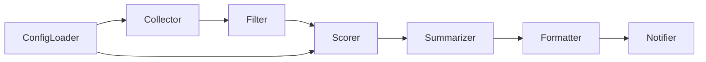
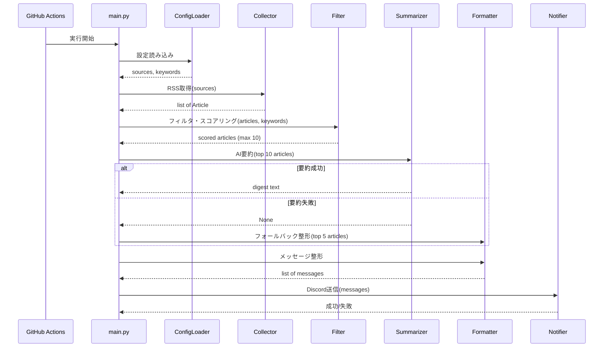

# Design Document

## Overview
**Purpose**: IT業界の最新ニュースを毎朝自動収集し、AIで日本語要約を生成してチャットサービスへ通知するパイプラインシステム。
**Users**: IT業界の動向を追うエンジニアが、業務開始前にダイジェストを受け取るために利用する。
**Impact**: 手動でのニュースチェックを自動化し、優先度付きの要約を日本語で提供する。

### Goals
- RSSフィードからIT業界ニュースを自動収集し、キーワードベースでスコアリングする
- AI APIで日本語ダイジェストを1回のAPI呼び出しで生成する
- チャットサービスへ自動通知する（フォールバック付き）
- YAML設定ファイルでソース・キーワードを管理可能にする
- 無料運用を前提とした最小構成で実現する

### Non-Goals
- 記事の永続保存・既読管理
- 記事本文のスクレイピング・全文取得
- Web UI・ダッシュボード
- 複数通知先への振り分け
- ユーザー認証・マルチテナント

## Boundary Commitments

### This Spec Owns
- RSSフィード収集パイプライン全体（取得→フィルタ→スコアリング→要約→通知）
- Article データモデルの定義と管理
- YAML設定ファイル（sources.yml, keywords.yml）のスキーマと読み込み
- AI要約のプロンプト設計とフォールバック処理
- チャット通知のフォーマットと分割送信
- CI/CDワークフロー定義

### Out of Boundary
- RSSフィード配信元の可用性・フォーマット保証
- AI API のサービス可用性・レスポンス品質
- チャットサービスの Webhook エンドポイント管理
- 実行をまたぐ記事の重複排除

### Allowed Dependencies
- 外部ライブラリ: feedparser, PyYAML, requests, google-genai, python-dateutil
- 外部サービス: Gemini API（要約生成）、Discord Webhook（通知）
- 実行基盤: GitHub Actions（cron + workflow_dispatch）

### Revalidation Triggers
- AI API のモデル名・エンドポイント・SDK インターフェースの変更
- チャットサービスの Webhook API 仕様変更（文字数制限等）
- RSSフィード配信元のURL・フォーマット変更
- Python バージョンアップに伴う依存ライブラリの互換性変更

## Architecture

### Architecture Pattern & Boundary Map

パイプラインアーキテクチャを採用する。各ステージは独立した関数モジュールとして実装し、Article リストを入出力の型で接続する。



**Architecture Integration**:
- 選択パターン: パイプライン（直列処理）— 各ステージが `list[Article]` を受け取り加工して次に渡す
- 依存方向: Config → Models ← 各モジュール（全モジュールが Models と Config に依存、モジュール間は直接依存しない）
- main.py がオーケストレーターとしてパイプラインを組み立て実行する

### Technology Stack

| Layer | Choice / Version | Role in Feature | Notes |
|-------|------------------|-----------------|-------|
| Language | Python 3.11+ | 実行言語 | 型ヒント・dataclass 活用 |
| RSS解析 | feedparser | RSS/Atom フィード解析 | |
| 設定管理 | PyYAML | YAML設定ファイル読み込み | |
| HTTP通信 | requests | Webhook POST送信 | |
| AI要約 | google-genai | Gemini API呼び出し | |
| 日付処理 | python-dateutil | RSS日付文字列のパース | |
| 実行基盤 | GitHub Actions | cron/手動実行 | Ubuntu latest |
| テスト | pytest | 単体テスト | |

## File Structure Plan

### Directory Structure
```
├── .github/
│   └── workflows/
│       └── daily_digest.yml    # CI/CDワークフロー定義
├── config/
│   ├── sources.yml             # RSSソース定義
│   └── keywords.yml            # 優先キーワード定義
├── src/
│   ├── __init__.py             # パッケージ初期化
│   ├── main.py                 # パイプラインオーケストレーター
│   ├── models.py               # Article dataclass 定義
│   ├── config_loader.py        # YAML設定読み込み
│   ├── collector.py            # RSS フィード取得
│   ├── filter.py               # フィルタリングとスコアリング
│   ├── summarizer_gemini.py    # Gemini API要約生成
│   ├── formatter.py            # 通知メッセージ整形・分割
│   └── notifier.py             # Discord Webhook送信
├── tests/
│   ├── test_filter.py          # フィルタ・重複排除テスト
│   ├── test_formatter.py       # メッセージ分割テスト
│   └── test_ranker.py          # スコアリングテスト
├── requirements.txt            # Python依存パッケージ
├── .env.example                # 環境変数テンプレート
└── README.md                   # セットアップ・運用ガイド
```

## System Flows

### メインパイプラインフロー



## Requirements Traceability

| Requirement | Summary | Components | Flows |
|-------------|---------|------------|-------|
| 1.1 | JST 07:30 スケジュール実行 | daily_digest.yml | — |
| 1.2 | 手動実行サポート | daily_digest.yml | — |
| 1.3 | 全パイプライン自動実行 | main.py | メインパイプライン |
| 2.1 | YAML設定からRSSソース読み込み | ConfigLoader | — |
| 2.2 | 各ソースからRSS取得 | Collector | メインパイプライン |
| 2.3 | ソース属性の保持 | ConfigLoader, models.py | — |
| 2.4 | 無効ソースのスキップ | Collector | — |
| 2.5 | 取得失敗時のログ・継続 | Collector | メインパイプライン |
| 3.1 | 空タイトル/URL除外 | Filter | — |
| 3.2 | URL重複排除 | Filter | — |
| 3.3 | 直近24-48時間優先 | Filter | — |
| 3.4 | 公開日不明は低スコア | Filter | — |
| 3.5 | AI送信最大10件 | Filter | — |
| 3.6 | 最終通知最大5件 | Summarizer prompt | — |
| 4.1 | 優先度別キーワード管理 | ConfigLoader, keywords.yml | — |
| 4.2 | 高優先度スコア加算 | Filter | — |
| 4.3 | 中優先度スコア加算 | Filter | — |
| 4.4 | 低優先度スコア加算 | Filter | — |
| 4.5 | ソースweight反映 | Filter | — |
| 4.6 | 時間減衰適用 | Filter | — |
| 5.1 | 1回のAPI呼び出しで要約 | Summarizer | メインパイプライン |
| 5.2 | タイトル等のみ渡す | Summarizer | — |
| 5.3 | 出力に要約・URL等含む | Summarizer prompt | — |
| 5.4 | ヘッダー・総評・キーワード含む | Summarizer prompt | — |
| 5.5 | モデル環境変数指定 | Summarizer | — |
| 5.6 | APIキー環境変数読み込み | Summarizer | — |
| 6.1 | API失敗時スコア上位5件通知 | Formatter | メインパイプライン |
| 6.2 | 失敗メッセージ付加 | Formatter | — |
| 6.3 | 異常終了させない | main.py, Summarizer | メインパイプライン |
| 7.1 | Webhook URL環境変数 | Notifier | — |
| 7.2 | Markdown形式フォーマット | Formatter | — |
| 7.3 | 2000文字超時の分割送信 | Formatter, Notifier | — |
| 7.4 | 送信成功ログ | Notifier | — |
| 7.5 | 送信失敗ログ | Notifier | — |
| 8.1 | RSSソースYAML管理 | ConfigLoader, sources.yml | — |
| 8.2 | キーワードYAML管理 | ConfigLoader, keywords.yml | — |
| 8.3 | 環境変数テンプレート | .env.example | — |
| 9.1-9.6 | ログ出力 | 各モジュール | — |
| 10.1 | URL重複排除テスト | test_filter.py | — |
| 10.2 | スコアリングテスト | test_ranker.py | — |
| 10.3 | メッセージ分割テスト | test_formatter.py | — |

## Components and Interfaces

| Component | Layer | Intent | Req Coverage | Key Dependencies | Contracts |
|-----------|-------|--------|--------------|------------------|-----------|
| models | Data | Article dataclass 定義 | 3.1-3.6 | なし | — |
| ConfigLoader | Config | YAML設定読み込み | 2.1, 2.3, 4.1, 8.1, 8.2 | PyYAML (P0) | Service |
| Collector | Pipeline | RSS フィード取得 | 2.2, 2.4, 2.5, 9.1, 9.2, 9.6 | feedparser (P0), models (P0) | Service |
| Filter | Pipeline | フィルタリング・スコアリング | 3.1-3.5, 4.2-4.6, 9.3 | models (P0), python-dateutil (P1) | Service |
| Summarizer | Pipeline | AI要約生成 | 5.1-5.6, 6.3, 9.4 | google-genai (P0), models (P0) | Service |
| Formatter | Pipeline | メッセージ整形・分割 | 6.1, 6.2, 7.2, 7.3 | models (P0) | Service |
| Notifier | Pipeline | Webhook通知送信 | 7.1, 7.3-7.5, 9.5 | requests (P0) | Service |
| main | Orchestrator | パイプライン組立・実行 | 1.3, 6.3 | 全コンポーネント (P0) | Batch |

### Data Layer

#### models

| Field | Detail |
|-------|--------|
| Intent | パイプライン全体で共有する記事データの型定義 |
| Requirements | 3.1-3.6 |

**Contracts**: State [x]

##### Data Model

```python
@dataclass
class Article:
    title: str
    url: str
    source: str
    category: str
    published_at: datetime | None
    summary: str
    score: float = 0.0
```

### Config Layer

#### ConfigLoader

| Field | Detail |
|-------|--------|
| Intent | YAML設定ファイルの読み込みと構造化データの提供 |
| Requirements | 2.1, 2.3, 4.1, 8.1, 8.2 |

**Dependencies**
- External: PyYAML — YAML解析 (P0)

**Contracts**: Service [x]

##### Service Interface

```python
@dataclass
class SourceConfig:
    name: str
    url: str
    category: str
    enabled: bool
    weight: float

@dataclass
class KeywordConfig:
    high_priority: list[str]
    medium_priority: list[str]
    low_priority: list[str]

def load_sources(path: str = "config/sources.yml") -> list[SourceConfig]: ...
def load_keywords(path: str = "config/keywords.yml") -> KeywordConfig: ...
```

### Pipeline Layer

#### Collector

| Field | Detail |
|-------|--------|
| Intent | 有効なRSSソースからフィードを取得し Article リストを返す |
| Requirements | 2.2, 2.4, 2.5, 9.1, 9.2, 9.6 |

**Dependencies**
- Inbound: ConfigLoader — ソース設定 (P0)
- External: feedparser — RSS/Atom解析 (P0)

**Contracts**: Service [x]

##### Service Interface

```python
def collect_articles(sources: list[SourceConfig]) -> list[Article]: ...
```

- 前提条件: sources が空でないこと
- 事後条件: 返却リストの各 Article は title, url, source, category が設定済み
- 不変条件: 個別ソースの取得失敗は例外を投げず、ログ記録して継続する

#### Filter

| Field | Detail |
|-------|--------|
| Intent | 記事のフィルタリング、スコアリング、ソート、上位選出 |
| Requirements | 3.1-3.5, 4.2-4.6, 9.3 |

**Dependencies**
- Inbound: models — Article 型 (P0)
- Inbound: ConfigLoader — KeywordConfig (P0)
- External: python-dateutil — 日付パース (P1)

**Contracts**: Service [x]

##### Service Interface

```python
def deduplicate(articles: list[Article]) -> list[Article]: ...
def remove_invalid(articles: list[Article]) -> list[Article]: ...
def score_articles(
    articles: list[Article],
    keywords: KeywordConfig,
) -> list[Article]: ...
def select_top(articles: list[Article], limit: int = 10) -> list[Article]: ...
```

**スコアリングアルゴリズム**:
- 高優先度キーワード一致: +3.0 / キーワード
- 中優先度キーワード一致: +2.0 / キーワード
- 低優先度キーワード一致: +0.5 / キーワード
- ソース weight: スコア × weight で乗算
- 時間減衰: 24時間以内 +2.0、48時間以内 +1.0、それ以外 +0.0
- published_at 不明: 時間ボーナスなし（+0.0）

#### Summarizer

| Field | Detail |
|-------|--------|
| Intent | Gemini APIで記事リストを1回のAPI呼び出しで日本語要約 |
| Requirements | 5.1-5.6, 6.3, 9.4 |

**Dependencies**
- Inbound: models — Article 型 (P0)
- External: google-genai — Gemini API SDK (P0)

**Contracts**: Service [x]

##### Service Interface

```python
def summarize(articles: list[Article]) -> str | None: ...
```

- 前提条件: `GEMINI_API_KEY` 環境変数が設定済み
- 事後条件: 成功時はダイジェストテキストを返却、失敗時は None を返却（例外を投げない）
- モデル: 環境変数 `GEMINI_MODEL` で指定、デフォルト `gemini-2.5-flash-lite`

#### Formatter

| Field | Detail |
|-------|--------|
| Intent | ダイジェストテキストをDiscord向けMarkdownメッセージに整形・分割 |
| Requirements | 6.1, 6.2, 7.2, 7.3 |

**Dependencies**
- Inbound: models — Article 型 (P0)

**Contracts**: Service [x]

##### Service Interface

```python
def format_digest(digest_text: str) -> list[str]: ...
def format_fallback(articles: list[Article]) -> list[str]: ...
def split_messages(text: str, limit: int = 2000) -> list[str]: ...
```

- 事後条件: 返却リストの各メッセージは limit 文字以下
- フォールバック: 冒頭に「⚠ Gemini APIによる要約に失敗したため、RSS情報をもとに簡易ダイジェストを送信します。」を付加

#### Notifier

| Field | Detail |
|-------|--------|
| Intent | Discord Webhookへメッセージリストを送信 |
| Requirements | 7.1, 7.3-7.5, 9.5 |

**Dependencies**
- External: requests — HTTP POST (P0)

**Contracts**: Service [x]

##### Service Interface

```python
def send_to_discord(messages: list[str]) -> bool: ...
```

- 前提条件: `DISCORD_WEBHOOK_URL` 環境変数が設定済み
- 事後条件: 全メッセージ送信成功時 True、いずれか失敗時 False
- 不変条件: 各メッセージを `{"content": message}` として POST

### Orchestrator Layer

#### main

| Field | Detail |
|-------|--------|
| Intent | パイプライン全体の組み立てと実行 |
| Requirements | 1.3, 6.3 |

**Contracts**: Batch [x]

##### Batch / Job Contract
- Trigger: GitHub Actions cron (UTC 22:30) または workflow_dispatch
- 入力: config/*.yml, 環境変数
- 出力: Discord通知
- 冪等性: 各実行は独立、副作用は Discord 通知のみ

## Error Handling

### Error Strategy
各ステージで例外を捕捉し、可能な限り処理を継続する。致命的でないエラーはログ記録のみで次のステージに進む。

### Error Categories and Responses
- **RSS取得失敗**: 該当ソースをスキップ、ログ記録、他ソースの処理続行
- **AI要約API失敗**: フォールバックモードに切り替え、スコア上位5件の簡易ダイジェストを生成
- **Discord通知失敗**: ログ記録、プロセスは正常終了（exit code 0）
- **設定ファイル不正**: 起動時にエラーログを出力し早期終了
- **環境変数未設定**: 起動時にエラーログを出力し早期終了

## Testing Strategy

### Unit Tests
- **test_filter.py**: URL重複排除（同一URL・異なるURL）、空タイトル/URL除外、published_at不明時のスコア処理
- **test_ranker.py**: 高/中/低優先度キーワードマッチによるスコア計算、ソースweight反映、時間減衰計算
- **test_formatter.py**: 2000文字以内メッセージの非分割、2000文字超メッセージの正確な分割、フォールバックメッセージの冒頭テキスト確認
